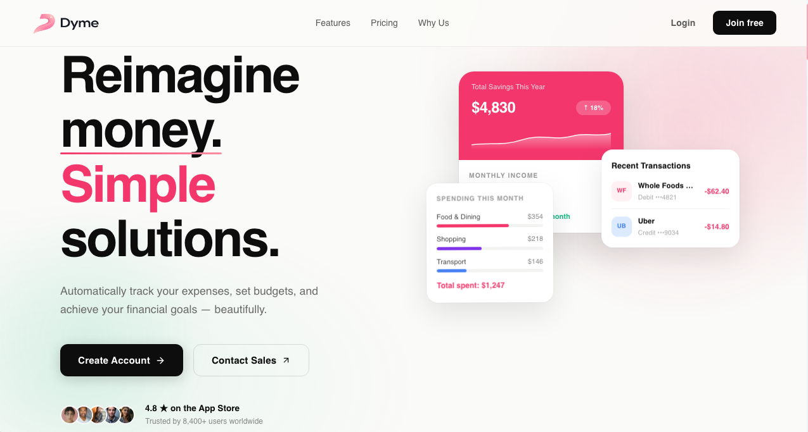
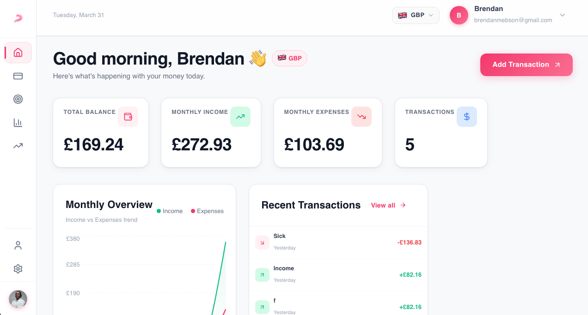
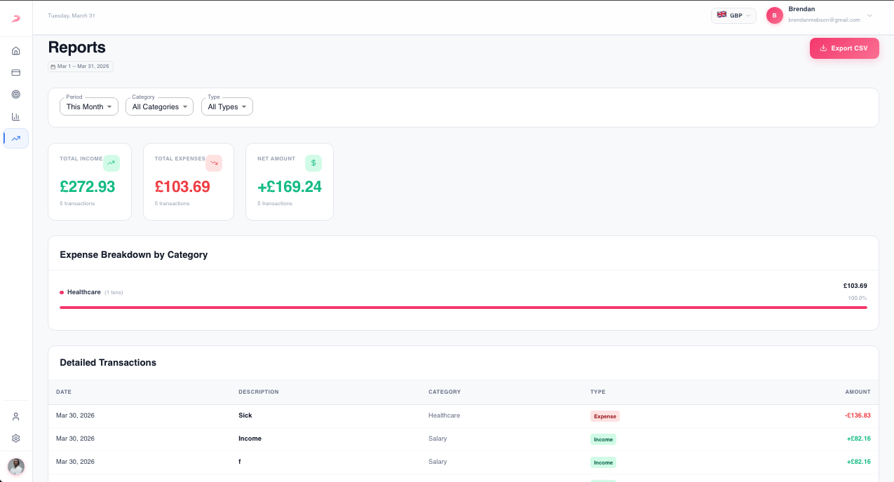
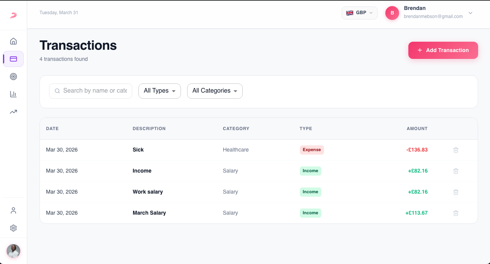
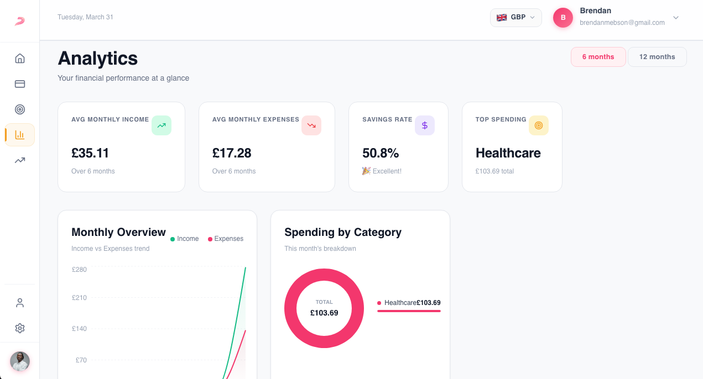

 
# Dyme — Premium Personal Finance Dashboard

[](https://reactjs.org/)
[](https://mui.com/)
[](https://supabase.com/)
[](https://expressjs.com/)

Dyme is a state-of-the-art personal finance management platform designed with **aesthetics, performance, and user experience** at its core. It empowers users to track their spending, manage budgets, and gain deep financial insights through a premium, responsive interface.



---

## 🎀 Key Features

### 📉 Intelligent Dashboard
A bird's-eye view of your financial health. Includes real-time balance tracking, monthly income vs. expense charts, and quick access to recent activities.
> 

### 💸 Multi-Currency Support
Independent currency tracking for every transaction. Switch your global view between **USD, EUR, GBP, and NGN** with live exchange rates.
- **🌸 Independent Tracking**: Save transactions in their original currency.
- **🌸 Global Conversion**: Dynamically view all reports in your preferred currency instantly.

### 📊 Advanced Analytics & Reports
Visualize your spending habits with interactive charts and detailed breakdowns.
- **💓 Spending by Category**: identify where your money goes.
- **💓 Monthly Trends**: Track your net worth over time.
- **💓 Exportable Reports**: Generate and download CSV reports for your records.
> 

### 🎯 Budget Management
Set monthly limits for specific categories and track your progress with smart progress bars.
- **✨ Automatic Calculation**: Budgets update instantly as you add transactions.
- **✨ Visual Alerts**: See when you're nearing or exceeding your limits.

### 👤 Profile & Security
- **🎨 Avatar Editor**: Upload and crop your profile picture with a built-in canvas editor.
- **🔐 Secure Auth**: Handled via Supabase with JWT-based sessions.
- **🌙 Dark Mode Ready**: Premium design system built with custom MUI tokens.

---

## 🛠 Tech Stack

### Frontend
- **🌸 Framework**: React 19 + Vite
- **🌸 Styling**: Material UI (MUI) v6 + Custom Design System
- **🌸 Icons**: Lucide React
- **🌸 Charts**: Recharts & MUI X Charts
- **🌸 Navigation**: React Router 7

### Backend
- **💓 Server**: Node.js + Express
- **💓 Validation**: Zod
- **💓 Database**: Supabase (PostgreSQL)
- **💓 Authentication**: Supabase Auth

---

## 🚀 Getting Started

### Prerequisites
- Node.js (v18+)
- npm or yarn
- Supabase account (or local instance)

### Installation

1. **Clone the repository**
   ```bash
   git clone https://github.com/Brendanmebson/Dyme.git
   cd dyme
   ```

2. **Backend Setup**
   ```bash
   cd backend
   npm install
   # Create a .env file with your Supabase credentials
   npm run dev
   ```

3. **Frontend Setup**
   ```bash
   cd ../frontend
   npm install
   npm run dev
   ```

---

## 📁 Project Structure

```text
dyme/
├── frontend/               # React application
│   ├── src/
│   │   ├── components/     # Reusable UI components
│   │   ├── context/        # Context API (Auth, Finance, Currency)
│   │   ├── pages/          # Main route views
│   │   ├── services/       # API interaction layer
│   │   └── designSystem.js # Theme & Design tokens
├── backend/                # Express API
│   ├── src/
│   │   ├── controllers/    # Business logic
│   │   ├── routes/         # Endpoint definitions
│   │   └── lib/            # Shared utilities (Supabase client)
```

---

## 📸 Screenshots

| Dashboard | Transactions | Analytics |
|:---:|:---:|:---:|
|  |  |  |

---

## 🤝 Contributing
Contributions are welcome! Please feel free to submit a Pull Request.

## 📄 License
This project is licensed under the MIT License.

---

## 🦄 Author

Built by **[brendanmebson](https://github.com/Brendanmebson)**

Got ideas, feedback, or want to collaborate? Reach out:

📧 [brendanmebson@gmail.com](mailto:brendanmebson@gmail.com)
